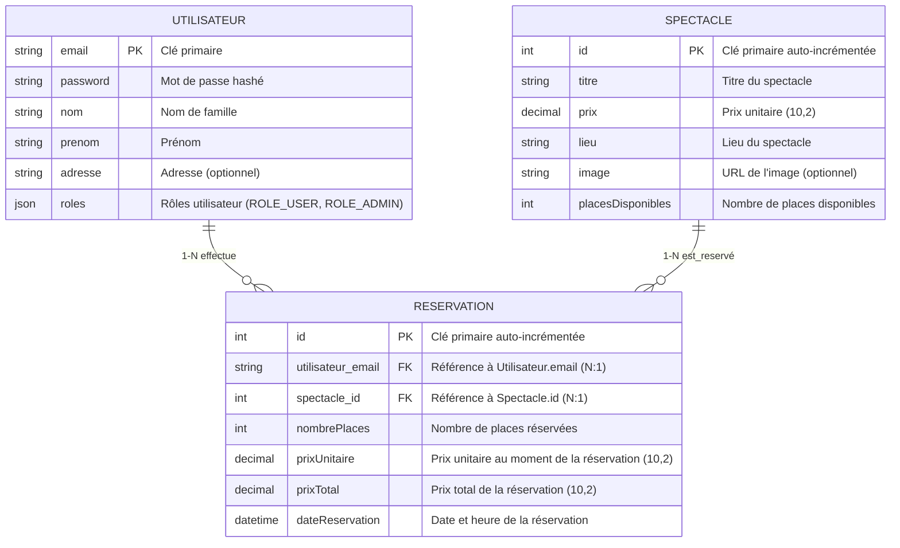

# Schéma d'Architecture du Modèle de Données

## Vue d'ensemble

Ce document présente l'architecture du modèle de données de l'application **Spektacles**, un système de réservation de spectacles.

## Diagramme Entité-Relation (ERD)



### Légende des relations

- **`||--o{`** : Relation **1-N** (One-to-Many)
  - `||` = exactement 1 (côté parent)
  - `o{` = 0 ou plusieurs (côté enfant)
  
- **Relations dans le diagramme** :
  - **UTILISATEUR (1) → RESERVATION (N)** : Un utilisateur peut effectuer plusieurs réservations
  - **SPECTACLE (1) → RESERVATION (N)** : Un spectacle peut être réservé plusieurs fois

## Description des Entités

### 1. Utilisateur

**Description** : Représente un utilisateur du système (client ou administrateur).

**Clé primaire** : `email` (string, 255 caractères)

**Attributs** :
- `email` (string, 255) : Identifiant unique de l'utilisateur, utilisé pour l'authentification
- `password` (string, 255) : Mot de passe hashé (bcrypt)
- `nom` (string, 255) : Nom de famille
- `prenom` (string, 255) : Prénom
- `adresse` (string, 500, nullable) : Adresse postale (optionnel)
- `roles` (json) : Tableau de rôles (ex: ["ROLE_USER"], ["ROLE_USER", "ROLE_ADMIN"])

**Relations** :
- **One-to-Many** avec `Reservation` : Un utilisateur peut effectuer plusieurs réservations

**Contraintes** :
- `email` est unique et non nullable
- `password`, `nom`, `prenom` sont obligatoires
- Implémente `UserInterface` et `PasswordAuthenticatedUserInterface` pour l'authentification Symfony

---

### 2. Spectacle

**Description** : Représente un spectacle disponible à la réservation.

**Clé primaire** : `id` (integer, auto-incrémenté)

**Attributs** :
- `id` (integer) : Identifiant unique auto-généré
- `titre` (string, 255) : Titre du spectacle
- `prix` (decimal, 10,2) : Prix unitaire d'une place
- `lieu` (string, 255) : Lieu où se déroule le spectacle
- `image` (string, 500, nullable) : URL ou chemin vers l'image du spectacle
- `placesDisponibles` (integer) : Nombre de places encore disponibles

**Relations** :
- **One-to-Many** avec `Reservation` : Un spectacle peut être réservé plusieurs fois

**Contraintes** :
- `titre`, `prix`, `lieu`, `placesDisponibles` sont obligatoires
- `placesDisponibles` doit être >= 0

---

### 3. Reservation

**Description** : Représente une réservation effectuée par un utilisateur pour un spectacle.

**Clé primaire** : `id` (integer, auto-incrémenté)

**Attributs** :
- `id` (integer) : Identifiant unique auto-généré
- `utilisateur` (ManyToOne -> Utilisateur) : Utilisateur ayant effectué la réservation
- `spectacle` (ManyToOne -> Spectacle) : Spectacle réservé
- `nombrePlaces` (integer) : Nombre de places réservées
- `prixUnitaire` (decimal, 10,2) : Prix unitaire au moment de la réservation (snapshot)
- `prixTotal` (decimal, 10,2) : Prix total calculé (prixUnitaire × nombrePlaces)
- `dateReservation` (datetime) : Date et heure de création de la réservation

**Relations** :
- **Many-to-One** avec `Utilisateur` : Chaque réservation appartient à un utilisateur
- **Many-to-One** avec `Spectacle` : Chaque réservation concerne un spectacle

**Contraintes** :
- `utilisateur`, `spectacle`, `nombrePlaces`, `prixUnitaire`, `prixTotal`, `dateReservation` sont obligatoires
- `nombrePlaces` doit être > 0
- La clé étrangère `utilisateur_email` référence `Utilisateur.email`
- La clé étrangère `spectacle_id` référence `Spectacle.id`

**Logique métier** :
- Lors de la création d'une réservation, `placesDisponibles` du spectacle est décrémenté
- Lors de la suppression d'une réservation, `placesDisponibles` est réincrémenté
- `prixUnitaire` et `prixTotal` sont stockés pour conserver l'historique même si le prix du spectacle change

---

## Cardinalités des Relations

| Relation | Type | Cardinalité | Description |
|----------|------|-------------|-------------|
| Utilisateur → Reservation | One-to-Many | 1:N | Un utilisateur peut effectuer plusieurs réservations |
| Spectacle → Reservation | One-to-Many | 1:N | Un spectacle peut être réservé plusieurs fois |
| Reservation → Utilisateur | Many-to-One | N:1 | Chaque réservation appartient à un seul utilisateur |
| Reservation → Spectacle | Many-to-One | N:1 | Chaque réservation concerne un seul spectacle |

## Diagramme de Classes UML (simplifié)

```
┌─────────────────────────────────┐
│         Utilisateur             │
├─────────────────────────────────┤
│ - email: string (PK)            │
│ - password: string              │
│ - nom: string                   │
│ - prenom: string                │
│ - adresse: string?              │
│ - roles: array                  │
├─────────────────────────────────┤
│ + getEmail(): string            │
│ + getPassword(): string         │
│ + getRoles(): array             │
│ + getUserIdentifier(): string   │
└─────────────────────────────────┘
              │
              │ 1
              │
              │ *
              ▼
┌─────────────────────────────────┐
│        Reservation              │
├─────────────────────────────────┤
│ - id: int (PK)                  │
│ - utilisateur: Utilisateur (FK) │
│ - spectacle: Spectacle (FK)     │
│ - nombrePlaces: int             │
│ - prixUnitaire: decimal         │
│ - prixTotal: decimal            │
│ - dateReservation: DateTime     │
├─────────────────────────────────┤
│ + getUtilisateur(): Utilisateur │
│ + getSpectacle(): Spectacle     │
│ + getNombrePlaces(): int        │
│ + getPrixTotal(): decimal       │
└─────────────────────────────────┘
              │
              │ *
              │
              │ 1
              ▼
┌─────────────────────────────────┐
│         Spectacle               │
├─────────────────────────────────┤
│ - id: int (PK)                  │
│ - titre: string                 │
│ - prix: decimal                 │
│ - lieu: string                  │
│ - image: string?                │
│ - placesDisponibles: int        │
├─────────────────────────────────┤
│ + getId(): int                  │
│ + getTitre(): string            │
│ + getPrix(): decimal            │
│ + getPlacesDisponibles(): int   │
└─────────────────────────────────┘
```

## Règles de Gestion

1. **Authentification** : Seuls les utilisateurs authentifiés (ROLE_USER) peuvent effectuer des réservations
2. **Administration** : Seuls les utilisateurs avec ROLE_ADMIN peuvent accéder au dashboard d'administration
3. **Disponibilité** : Une réservation ne peut être créée que si `placesDisponibles >= nombrePlaces`
4. **Historique des prix** : Les prix sont stockés dans la réservation pour préserver l'historique
5. **Intégrité référentielle** : La suppression d'un utilisateur ou d'un spectacle doit gérer les réservations associées (cascade ou restriction)

## Technologies Utilisées

- **ORM** : Doctrine ORM (Symfony)
- **Base de données** : SQLite (incluse dans le projet)
- **Framework** : Symfony 7.3
- **Authentification** : Symfony Security Component

## Notes d'Implémentation

- L'entité `Utilisateur` utilise l'email comme clé primaire (non-standard mais fonctionnel)
- Les rôles sont stockés en JSON pour permettre plusieurs rôles par utilisateur
- Les prix sont stockés en DECIMAL(10,2) pour garantir la précision financière
- La date de réservation est automatiquement définie lors de la création
- Les places disponibles sont gérées automatiquement lors de la création/suppression de réservations

